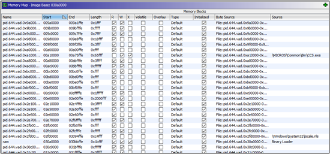

# Ghidra VADInfo mapping
To facilitate the reverse engineering of the module, Kroll developed a short Ghidra script to take the output of the Volatility 3 vadinfo module and quickly map the memory to the correct locations within the Ghidra CodeBrowser.

When a process of interest has been identified, all the process memory can be dumped using the Volatility 3 vadinfo module to a directory, with the standard output of the module written to a text file. The module includes the VPN start and end for each memory section, source file when available and the memory protection (Figure 6).

```
py E:\tools\volatility3\vol.py -f .\memory_dump -o 644_vadinfo windows.vadinfo --pid 644 --dump > vadinfo.out
```

After opening a section of memory and setting the language for the CodeBrowser, the Ghidra script can be run, prompting for the output directory (644_vadinfo) and output file (vadinfo.out). The script will then create the appropriate memory map for all available dump files.


